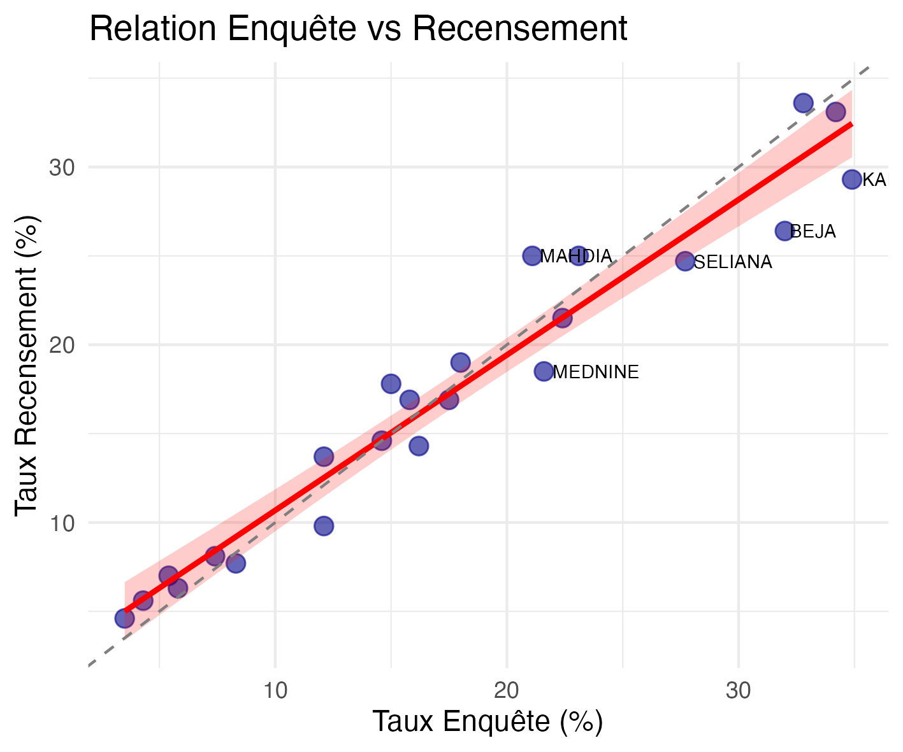
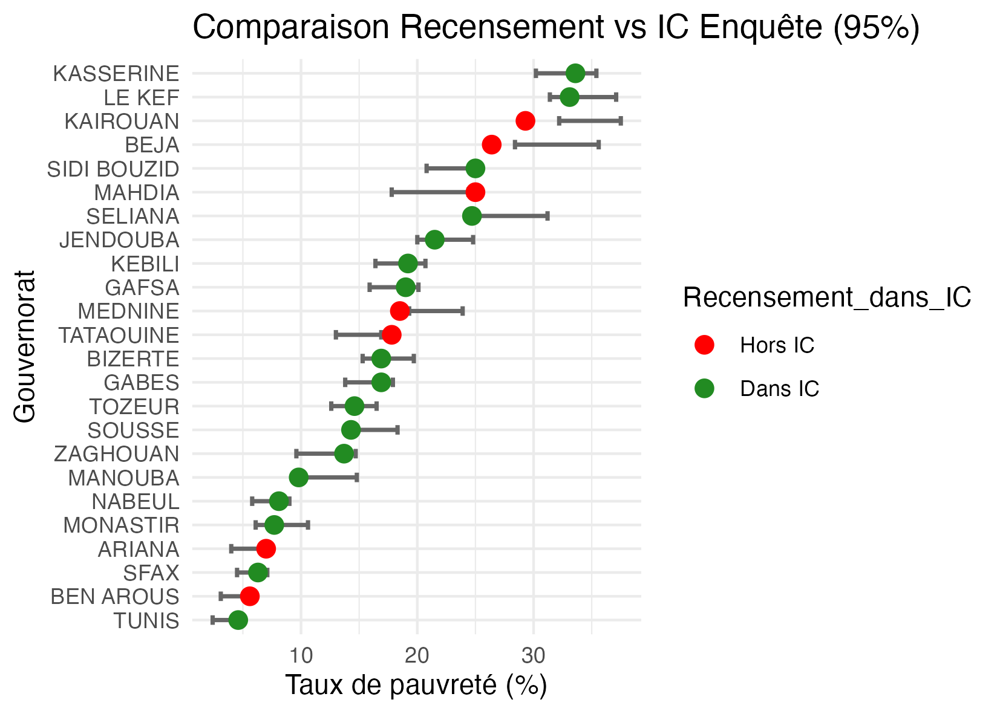
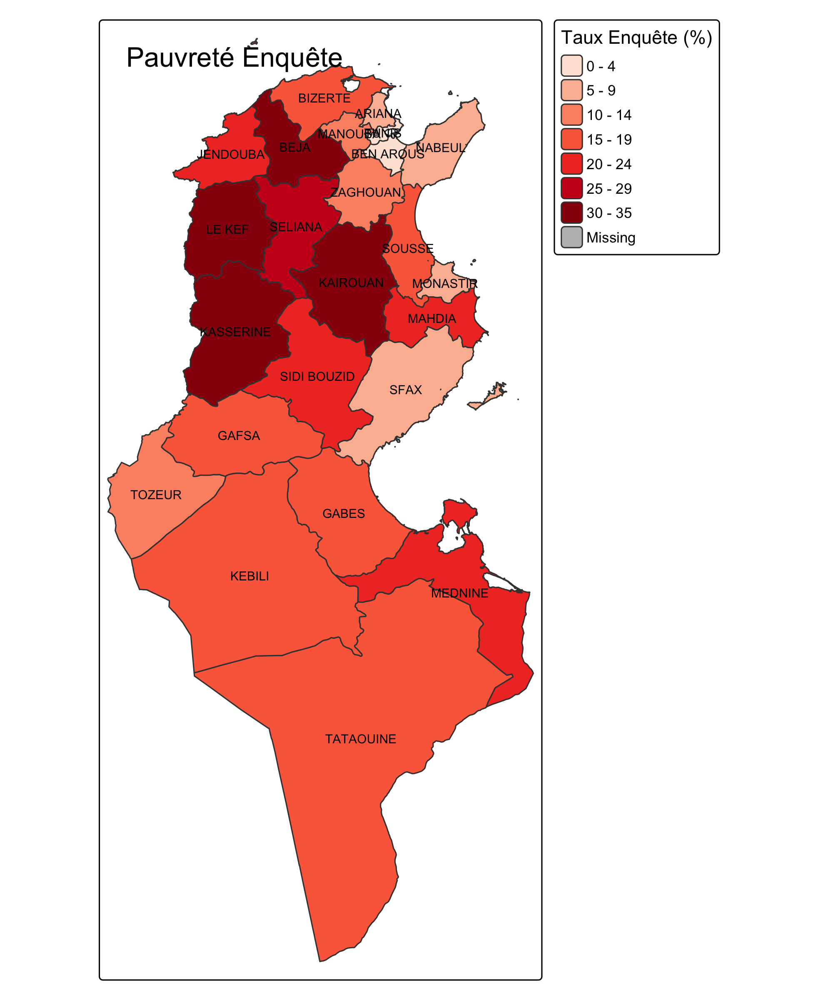
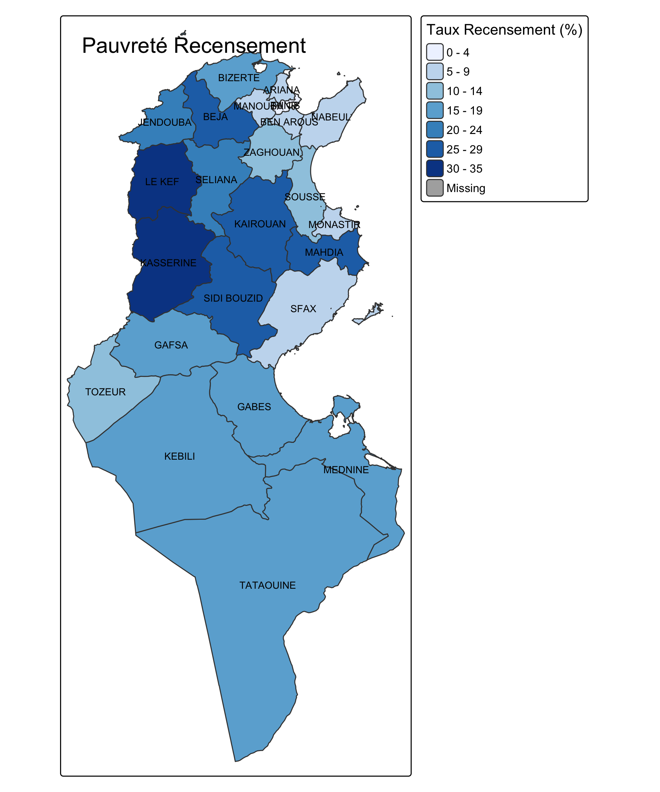
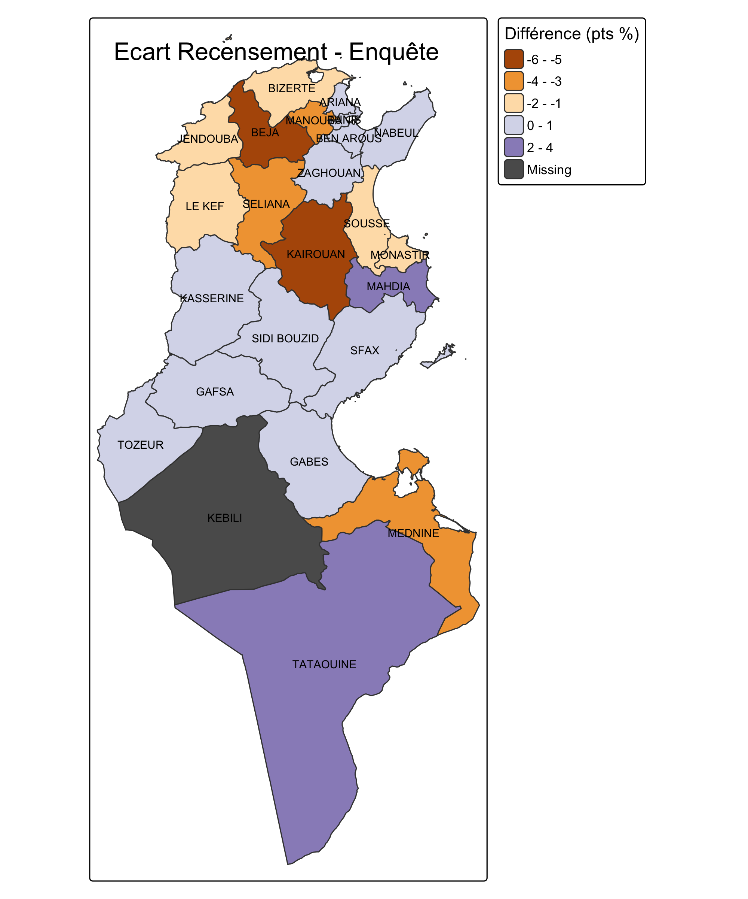
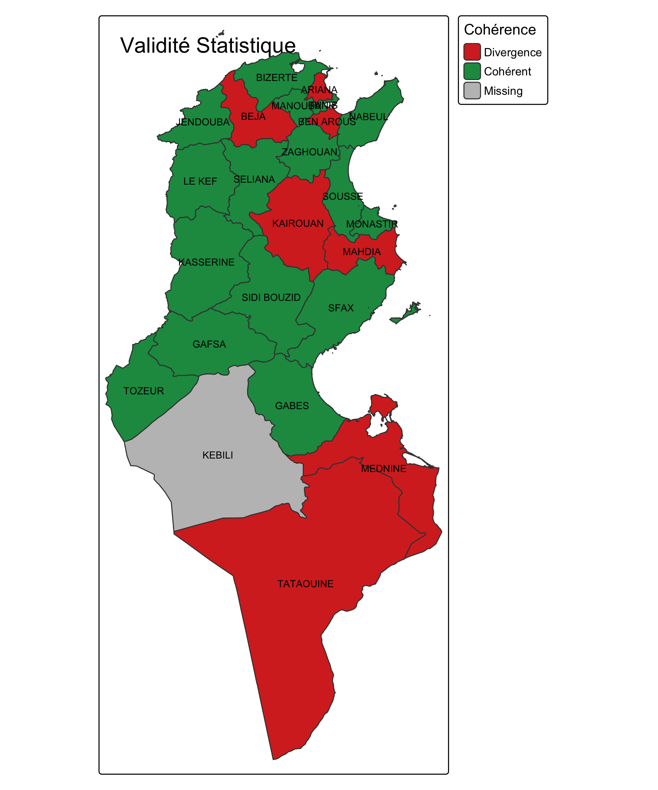
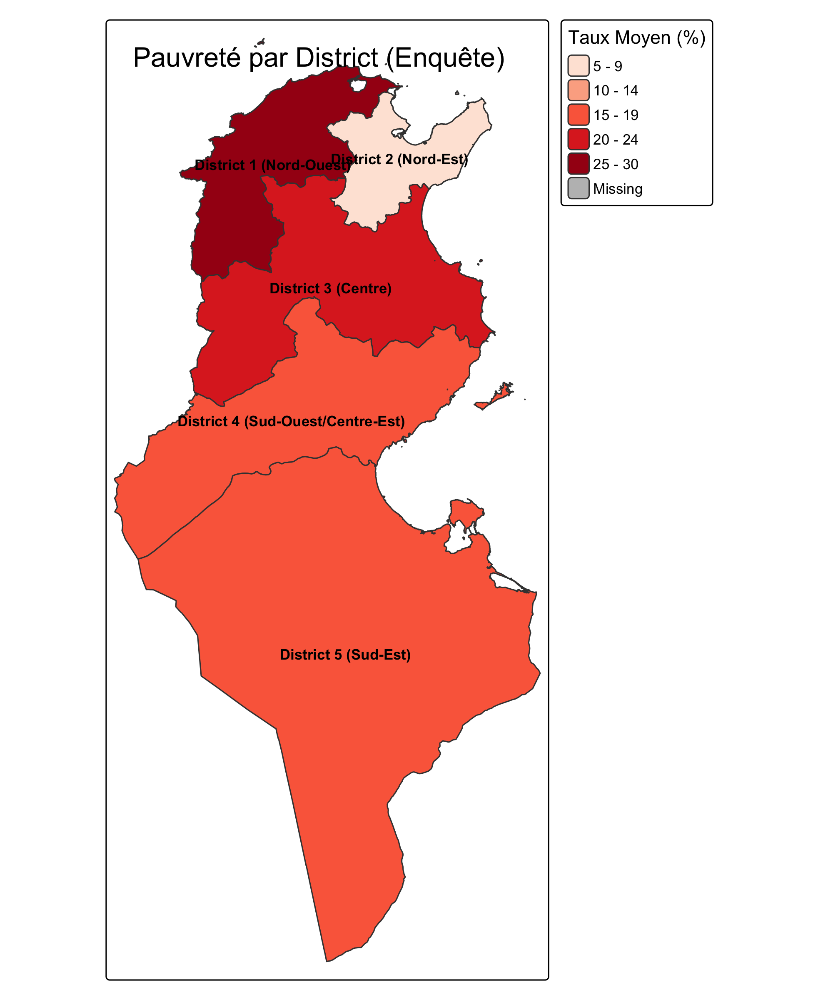
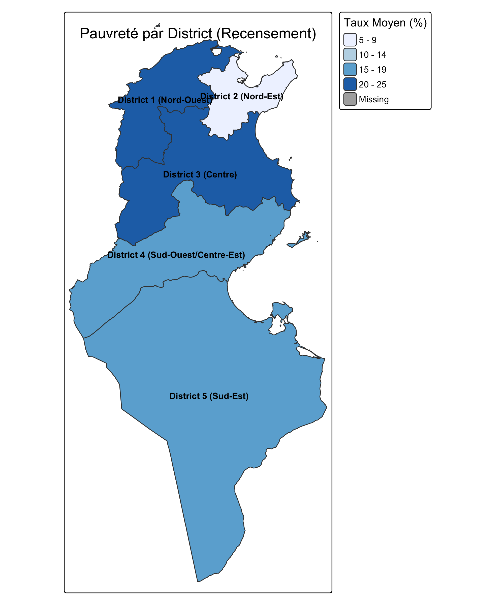
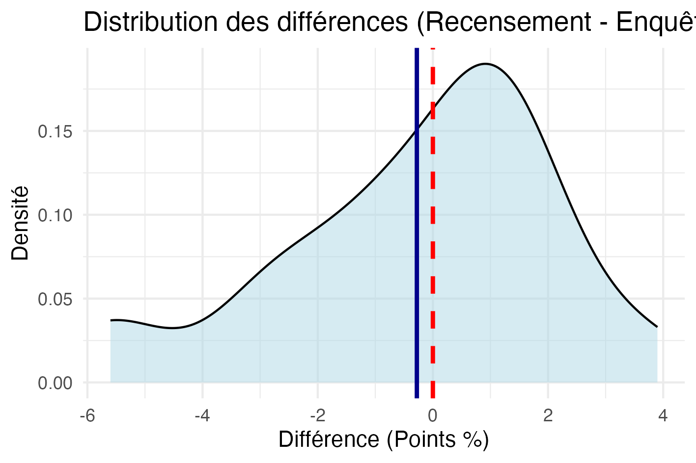

# 📊 Analyse Comparative de la Pauvreté en Tunisie

Analyse statistique et cartographique comparative des taux de pauvreté en Tunisie selon deux sources : données d'enquête et données du recensement. Le projet inclut une validation de cohérence statistique, des visualisations géospatiales et une application Shiny interactive.

## 🎯 Objectifs du Projet

Ce projet compare les estimations de pauvreté issues de deux sources différentes :
- **Données d'enquête** : avec intervalles de confiance à 95%
- **Données du recensement** : valeurs exhaustives

### Questions de recherche
1. Les estimations d'enquête et de recensement sont-elles cohérentes ?
2. Quelles régions présentent les plus grandes divergences ?
3. Les taux de recensement tombent-ils dans les intervalles de confiance de l'enquête ?
4. Quelle est la distribution géographique de la pauvreté en Tunisie ?

## 📁 Structure du Projet

.
├── pauvrete.csv # Données brutes (23 gouvernorats)

├── pauvrete_complete.csv # Données enrichies avec variables calculées

├── pauvrete_par_districts.csv # Agrégation par district

├── statistiques_descriptives.csv # Résumé statistique

├── resultats_regression.csv # Résultats du modèle linéaire

├── decoupage.geojson.json # Frontières géographiques (GeoJSON)

├── pauvrete.R # Script d'analyse principal

├── app.R # Application Shiny standard

├── app-design.R # Application Shiny avec design avancé

├── rapport-design.Rmd # Rapport R Markdown stylisé

├── rapport-final.Rmd # Rapport R Markdown complet

└── images/ # Visualisations générées

├── 01_barplot_taux_pauvrete.png

├── 02_boxplot_distribution.png

├── 03_scatter_enquete_vs_recensement.png

├── 04_distribution_differences.png

├── 05_ic_coherence.png

├── 06_carte_enquete_gouvernorat.png

├── 07_carte_recensement_gouvernorat.png

├── 08_carte_difference_gouvernorat.png

├── 09_carte_coherence_gouvernorat.png

├── 10_carte_enquete_districts.png

└── 11_carte_recensement_districts.png

## 🔧 Technologies Utilisées

- **R** (version ≥ 4.0)
- **Packages R** :
  - `tidyverse` - Manipulation et visualisation de données
  - `sf` - Analyse de données géospatiales
  - `tmap` - Cartographie thématique
  - `shiny` - Application web interactive
  - `ggplot2` - Visualisation avancée
  - `DT` - Tableaux interactifs

## 🚀 Installation et Utilisation

### Prérequis

install.packages(c("tidyverse", "sf", "tmap", "shiny", "DT", "rmarkdown"))

### Exécuter l'analyse principale

source("pauvrete.R")

### Lancer l'application Shiny

**Version standard**

shiny::runApp("app.R")

**Version avec design avancé**

shiny::runApp("app-design.R")

### Générer les rapports HTML

**Version standard**

rmarkdown::render("rapport-final.Rmd")

**Version avec design avancé**

rmarkdown::render("rapport-design.Rmd")

**Version avec design plus avancé**

rmarkdown::render("rapport-design-final_Version.Rmd")

## 📊 Résultats Clés

### Statistiques Descriptives

| Source | Moyenne | Médiane | Min | Max | Écart-type |
|--------|---------|---------|-----|-----|------------|
| **Enquête** | 17.6% | 16.2% | 3.5% | 34.9% | 9.85% |
| **Recensement** | 17.4% | 16.9% | 4.6% | 33.6% | 8.86% |

### Analyse des Différences
- **Différence moyenne** : -0.28 points de pourcentage
- **p-value** : 0.588 (pas de différence significative)
- **Cohérence statistique** : 15/23 gouvernorats (65%) où le recensement tombe dans l'IC95% de l'enquête

### Régions à Forte Pauvreté
1. **Kairouan** : 34.9% (enquête), 29.3% (recensement)
2. **Le Kef** : 34.2% (enquête), 33.1% (recensement)
3. **Kasserine** : 32.8% (enquête), 33.6% (recensement)
4. **Béja** : 32.0% (enquête), 26.4% (recensement)

### Régions à Divergence Élevée
- **Béja** : -5.6 points (enquête > recensement)
- **Kairouan** : -5.6 points (enquête > recensement)
- **Mahdia** : +3.9 points (recensement > enquête)

## 📈 Visualisations

### Comparaison Enquête vs Recensement

*Relation linéaire forte (R² élevé) entre les deux sources avec quelques divergences pour certains gouvernorats.*

### Intervalles de Confiance et Cohérence

*Graphique montrant les gouvernorats où le taux de recensement tombe dans l'intervalle de confiance à 95% de l'enquête (points verts = cohérent, points rouges = divergence).*

### Cartes par Gouvernorat

#### Taux de Pauvreté par Source

  
  
  
  
  

*Distribution géographique de la pauvreté : le nord-ouest (Le Kef, Kasserine, Béja) et le centre-ouest (Kairouan, Sidi Bouzid) présentent les taux les plus élevés.*

#### Analyse des Écarts

  
  
  
  
  

**Gauche** : Carte des différences (recensement - enquête). Les zones orange/marron indiquent une surestimation par l'enquête, les zones violettes une sous-estimation.

**Droite** : Carte de validité statistique. Zones vertes = recensement dans IC95% de l'enquête (cohérent), zones rouges = divergence significative.

### Cartes par District

Les gouvernorats sont regroupés en **5 districts régionaux** pour une analyse macro-géographique :
- **District 1** : Nord-Ouest (Béja, Jendouba, Le Kef, Siliana)
- **District 2** : Nord-Est (Tunis, Ariana, Ben Arous, Manouba, Nabeul, Zaghouan, Bizerte)
- **District 3** : Centre (Sousse, Monastir, Mahdia, Sfax)
- **District 4** : Centre-Ouest (Kairouan, Kasserine, Sidi Bouzid)
- **District 5** : Sud (Gabès, Médenine, Tataouine, Gafsa, Tozeur, Kébili)

  
  

*Taux moyens de pauvreté par district selon l'enquête (gauche) et le recensement (droite). Le District 1 (Nord-Ouest) présente les taux les plus élevés (~27-29%), tandis que le District 2 (Nord-Est) affiche les taux les plus faibles (~8-9%).*

### Distribution des Différences

*Distribution des écarts centrée autour de 0 avec p-value = 0.588 (pas de biais systématique).*

## 🌐 Application Shiny Interactive

L'application Shiny offre :
- **Comparaison interactive** des deux sources
- **Filtrage par gouvernorat** ou district
- **Cartes choroplèthes dynamiques**
- **Tableaux de données** téléchargeables
- **Tests statistiques** en temps réel
- **Visualisation des intervalles de confiance**

### Fonctionnalités principales
1. 📍 **Dashboard** : Vue d'ensemble avec cartes et graphiques
2. 📊 **Statistiques** : Résumés descriptifs et tests
3. 🗺️ **Cartographie** : Visualisation géospatiale interactive
4. 📥 **Export** : Téléchargement des données et graphiques

## 📝 Méthodologie

### 1. Préparation des Données
- Nettoyage et harmonisation des noms de gouvernorats
- Calcul des intervalles de confiance à 95%
- Création de variables dérivées (différences, largeur IC)

### 2. Analyse Statistique
- Test t apparié pour comparer enquête et recensement
- Vérification de la cohérence (recensement dans IC95%)
- Régression linéaire simple (recensement ~ enquête)

### 3. Analyse Géospatiale
- Jointure avec fichiers GeoJSON
- Cartographie choroplèthe par gouvernorat et district
- Visualisation des divergences spatiales

### 4. Validation
- Test de normalité des résidus
- Analyse de la distribution des différences
- Identification des outliers géographiques

## ⚠️ Limites de l'Étude

- **Différences méthodologiques** : enquête par échantillonnage vs recensement exhaustif
- **Temporalité** : possibles différences de périodes de collecte
- **Définition de la pauvreté** : hypothèse de définition identique entre les deux sources
- **Qualité des données** : incertitudes sur les écarts-types du recensement
- **Échelle d'analyse** : agrégation au niveau gouvernorat masque les variations locales

## 📖 Données

### Sources
- **Enquête** : Données d'enquête par échantillonnage avec intervalles de confiance
- **Recensement** : Données exhaustives du recensement national
- **Géométries** : Découpage administratif de la Tunisie (gouvernorats et districts)

### Variables clés
- `Taux_enquete` : Taux de pauvreté estimé par enquête (%)
- `Taux_recensement` : Taux de pauvreté du recensement (%)
- `IC95_bas` / `IC95_haut` : Limites de l'intervalle de confiance
- `Diff` : Différence recensement - enquête (points de %)
- `Recensement_dans_IC` : Indicateur de cohérence statistique

## 👤 Auteur

**Mohamed Amine Mazzez**
-  Étudiant ingénieur
- 📍 Ariana, Tunisie

---

*Projet réalisé dans le cadre d'une analyse statistique et géospatiale en R pour un projet de classe- Décembre 2025*

